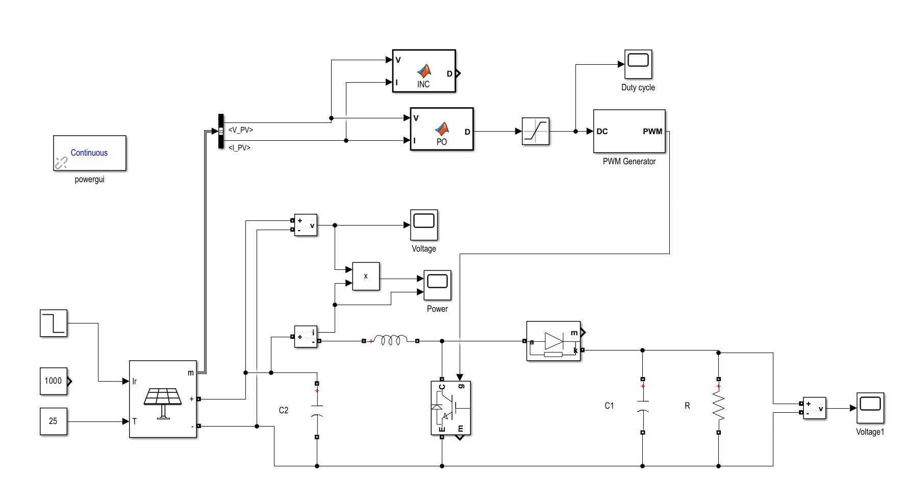
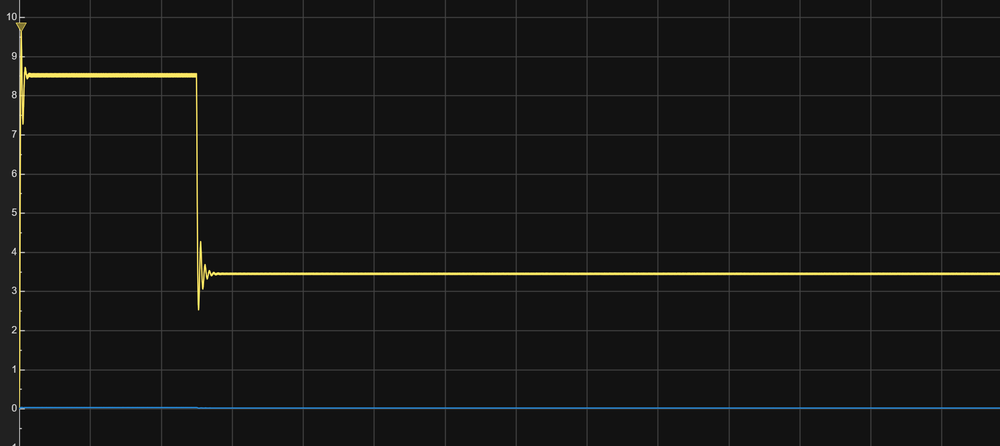
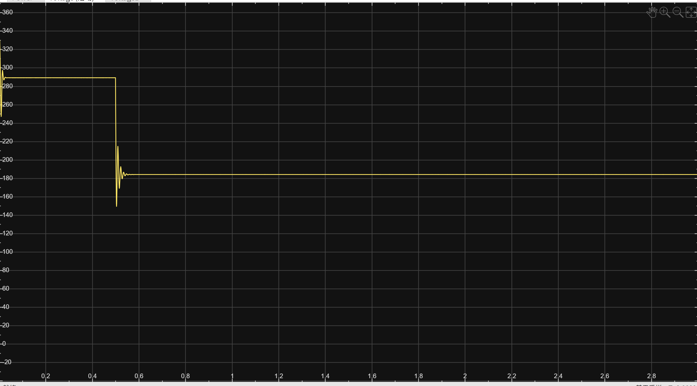

[English](./README_EN.md) | 简体中文
# 光伏系统性能与 MPPT 仿真研究

本仓库用于整理本人研究项目中使用的 **MATLAB/Simulink 仿真模型** 与 **PVsyst 仿真数据**。研究主要围绕光伏系统的 **组件朝向、遮挡影响、能量效率以及最大功率点跟踪（MPPT）** 展开。

## 仓库内容

* **Simulink 仿真模型**

  * 光伏系统建模
  * DC-DC Boost 升压变换器
  * PWM 控制
  * 扰动观察法（P&O）MPPT 算法
  * 增量电导法（Incremental Conductance）MPPT 算法
  * 不同光照条件下的 MPPT 跟踪响应

* **PVsyst 仿真数据**

  * 不同光伏板倾角下的发电量
  * 不同朝向与方位角下的系统性能
  * 遮挡条件下的性能分析
  * Performance Ratio（PR）与 Specific Yield 数据
  * 用于技术可行性与经济性分析的相关结果

## 项目目的

本项目旨在分析不同光伏系统设计参数及环境条件对发电性能的影响，并通过 MATLAB/Simulink 建立 MPPT 控制模型，比较不同算法在光照变化条件下的最大功率点跟踪效果。

PVsyst 仿真结果用于进一步评估不同组件朝向、倾角和遮挡条件对年度发电量及系统性能的影响。

本仓库中的模型与数据均为研究项目分析与结果展示的一部分。

## Simulink 模型

模型由光伏阵列、输入滤波电容、Boost 升压变换器、PWM 发生器、阻性负载以及 MPPT 控制器组成。控制部分实现了扰动观察法（P&O）和增量电导法（INC），可用于比较两种算法在光照变化条件下的动态响应。



### 主要仿真参数

| 参数 | 设置值 | 说明 |
| --- | ---: | --- |
| Boost 电感 L | 3 mH | 限制电感电流纹波 |
| 光伏侧电容 C2 | 2 mF | 抑制光伏端电压纹波 |
| 输出侧电容 C1 | 1 mF | 稳定 Boost 输出电压 |
| PWM 开关频率 | 10 kHz | 开关周期为 100 μs |
| PWM 采样时间 | 5 μs | 每个开关周期包含 20 个采样点 |
| MPPT 更新周期 | 5 ms | 对多个 PWM 周期进行平均后更新占空比 |
| 初始占空比 | 0.3 | MPPT 控制初值 |

## 仿真结果

仿真在约 0.5 s 时改变光照条件，用于测试 MPPT 控制器对环境突变的跟踪能力。功率曲线在光照变化后出现短暂过渡，随后收敛到新的稳定工作点。



光伏端电压在光照阶跃后由原工作点过渡到新的最大功率点电压，并在短暂振荡后保持稳定。



### 纹波优化

初始模型采用 1 kHz PWM、1 mH 电感和 1 mF 光伏侧电容，电感电流及光伏端电压纹波较为明显。根据 Boost 变换器电感电流纹波关系

```text
ΔIL ≈ Vpv × D / (L × fs)
```

将 PWM 频率提高至 10 kHz、电感调整为 3 mH，并将光伏侧电容增加至 2 mF。控制侧对电压和电流采样进行平均，降低 MPPT 更新频率，并在最大功率点附近使用较小的占空比扰动步长，以减少 P&O 算法的稳态振荡。

调试过程中通过在相同功率级参数下对比 INC 与 P&O 的响应，将高频开关纹波与 MPPT 引起的低频周期振荡分别定位，最终使系统在光照变化后能够重新收敛并保持稳定。
